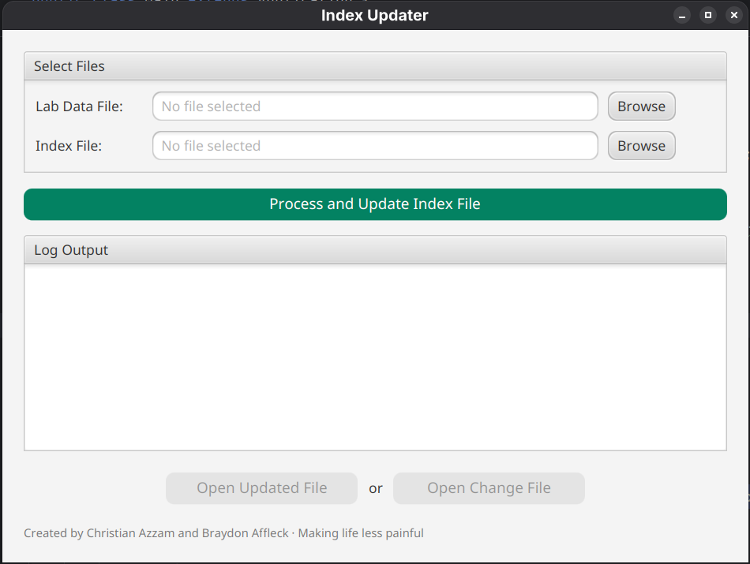

# EnviroAntiMWP

EnviroAntiMWP (manual work process) is tool that quickly copies environmental lab data collected in the field, 
and processed by a 3rd party lab, to propitiatory index files. The goal of this project 
is to partially automate data transfer from one standard to another. This job was previously done
completely by hand. It not only required enormous amounts of time, but also by nature was very prone to human error.
By automating the matching of data, and outputting a format which can easily be checked over, we both reduce time and
improve accuracy.

## Authors
This project is developed by us, two University of Guelph students, Christian Azzam ([@MetallicGoat](https://github.com/MetallicGoat)), 
and Braydon Affleck ([@baff-collab](https://github.com/baff-collab)). We developed this project on the side while working 
Co-op jobs to help automate one aspect of [@baff-collab](https://github.com/baff-collab)'s Co-op position. With more 
programing experience [@MetallicGoat](https://github.com/MetallicGoat) wrote the initial script and UI. Since then, both
of us have collaborated to expand the tooling as a hobby project in our free time outside of work.

## How it works
This app reads a lab data file (an xlsx file containing a table of test locations and associated
environmental test results) and then converts that data into the index files standard (a xlsx file 
containing a table of archived lab data from previous years). The app's function can
be broken down into 4 basic steps:

1. The lab data file is scanned for all locations with test results. 
2. Once all locations are stored in memory, the index file is then cross-referenced to find common location ids.
3. The data in the lab file is reorganized to match the structure of the data in the lab file.
4. A new column in the is inserted into the index file in and the new data is written.

## The Problems
- Index File parameter data is inconsistent, and does not always match with lab data parameter names
  - **The solution** was to create an enum to represent every possible parameter that can appear, and setting its parameters to an array of alternate name that can appear in index file
  - Using this enum, were are able to match parameter data across files 

- Index File's are generally inconsistent with formatting (e.g. date rows and sheet orders are inconstant)
  - **The solution** was to write various functions that try and guess where rows and sheets are
  - For Example, date rows are guessed by picking colum, and iterating across their cells until dates are found
  - Another Example is sheets are found using string contains checks on sheet names for common naming schemes

## UI Screenie

## Plans (Last updated 2025-06-26)
- [ ] Allow users to override 'guessed' constants from UI
- [ ] Automate graph data sheet in index workbook

### Tools used
- Java
- JavaFX
- Maven
- Apache POI